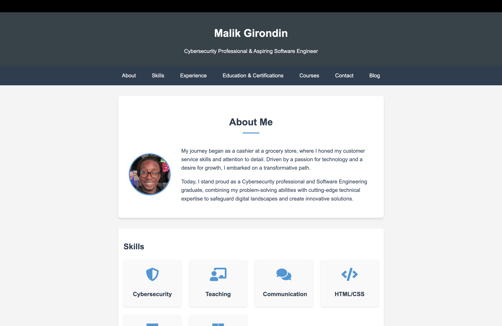

# Malik Girondin's Portfolio Site



## 🚀 Welcome to My Digital Space!

This repository houses the code for my professional portfolio site, showcasing my journey and accomplishments in the world of cybersecurity and software engineering.

🔗 **[View My Portfolio](https://malik-girondin.github.io/Portfolio-Site/)**

## 🛠 Features

- **About Me**: Learn about my background and professional journey
- **Skills**: Explore my technical expertise and competencies
- **Work Experience**: Dive into my professional roles and achievements
- **Education & Certifications**: Check out my academic background and industry certifications
- **Courses**: Discover the specialized training I've created
- **Blog**: Read my thoughts and insights on cybersecurity and software engineering
- **Contact**: Connect with me through various platforms

## 🖥 Technologies Used

- HTML5
- CSS3
- JavaScript
- GitHub Pages for hosting

## 🚀 Getting Started

To run this project locally:

1. Clone the repository:
   ```
   git clone https://github.com/malik-girondin/Portfolio-Site.git
   ```
2. Navigate to the project directory:
   ```
   cd Portfolio-Site
   ```
3. Open `index.html` in your preferred browser.

## 🤝 Contributing

While this is a personal portfolio, I'm open to suggestions! If you have ideas for improvements:

1. Fork the repository
2. Create your feature branch (`git checkout -b feature/AmazingFeature`)
3. Commit your changes (`git commit -m 'Add some AmazingFeature'`)
4. Push to the branch (`git push origin feature/AmazingFeature`)
5. Open a pull request

## 📬 Contact

Malik Girondin - [malikgirondin@gmail.com](mailto:malikgirondin@gmail.com)

Project Link: [https://github.com/malik-girondin/Portfolio-Site](https://github.com/malik-girondin/Portfolio-Site)

## 🙏 Acknowledgements

- [Font Awesome](https://fontawesome.com)
- [GitHub Pages](https://pages.github.com)

---

⭐️ From [malik-girondin](https://github.com/malik-girondin)
